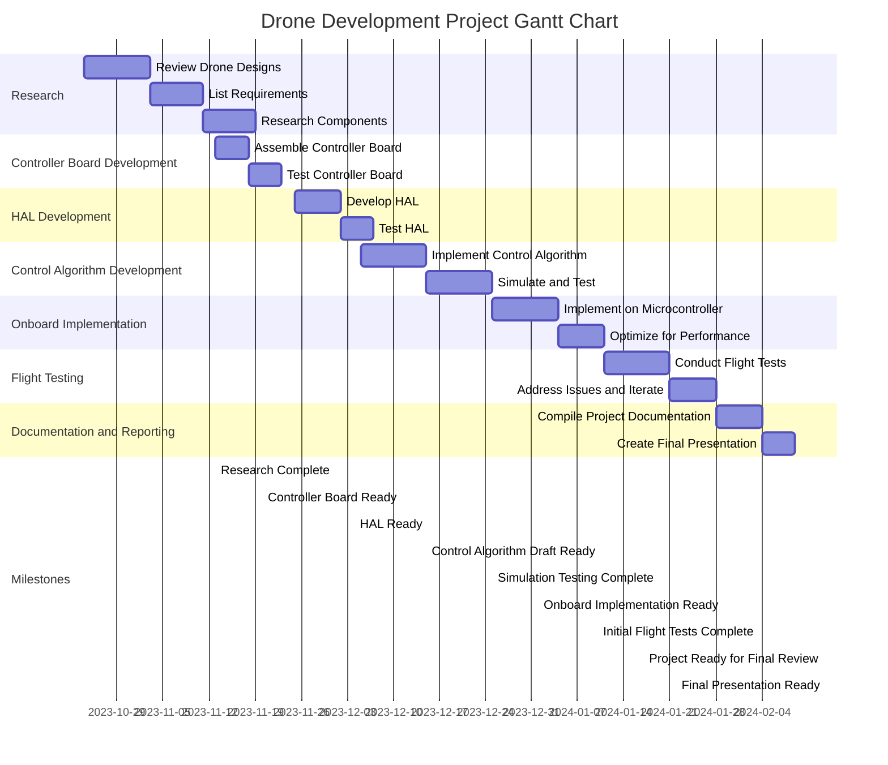

# Custom drone controller - Project Schedule

## Tasks
 - Task 1: Perform initial research and select parts for the controller board.
 - Task 2: Assemble and verify the operation of the control board.
 - Task 3: Implement a simple HAL for the different drone components.
 - Task 4: Implement a draft of the researched control algorithm in a high level language and perform rudimentary simulation and evaluations of the chosen control scheme.
 - Task 5: Implement said algorithm in an efficient manner in C for the microcontroller onboard.
 - Task 6: Test the initial implementation and note down things that need improvements.
 - Repeat 4-6 and iterate until stable level flight is achieved.
 - Task 7: Compile all the knowledge and insights gained from the above and compile it into a final presentation.

## Milestones
 - Milestone no. 1: Assembling and testing a working control board.
 - Milestone no. 2: Being able to control: motor speeds, read control signals from the RC, read battery voltage and read the IMU thought the HAL.
 - Milestone no. 3: Having a working simulation of the PID loops and other control systems, being able to feed generated or measured sensor data into it to see how the system responds.
 - Milestone no. 4: Completing the first flight with our own controller.
 - Milestone no. 5: Completing a level flight with the final stabilization algorithm.
 - Milestone no. 6: [Final presentation]: Compiling documentation, code, photos and videos from the above and creating a final presentation.

 ## Gantt chart

More about how to make a gantt chart in mermaid, you will find here: [Mermaid Gantt](https://mermaid.js.org/syntax/gantt.html)
