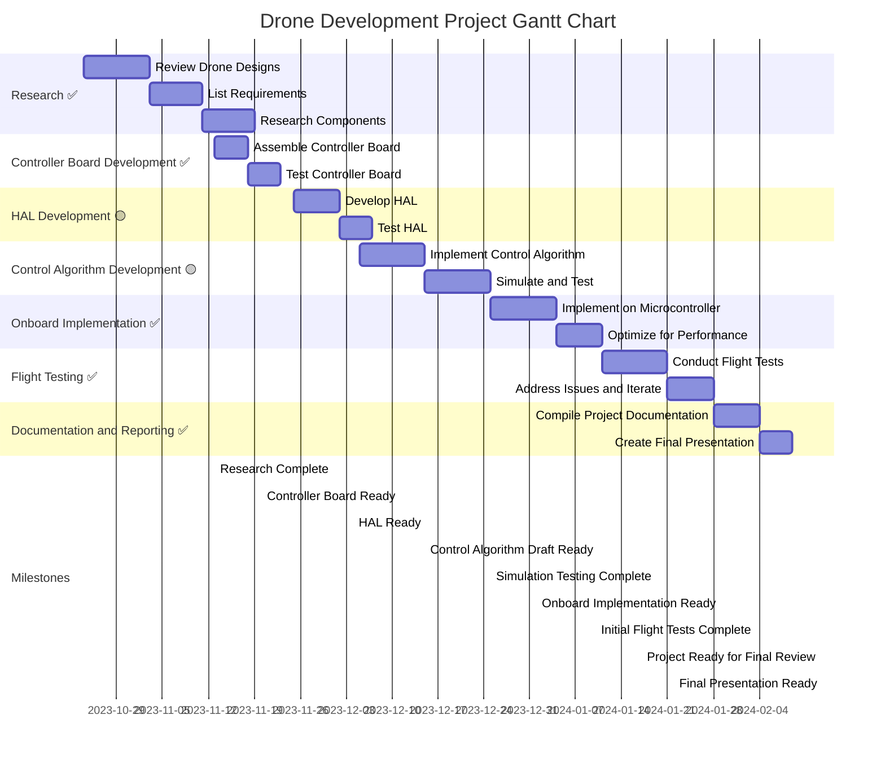

# Custom Drone Controller - Project report

## Introduction

In the past few years, multirotor drones went from a niche hobby to a massive industry spanning many different applications ranging from cinematography to industry and even military applications. This is primarily due to advances in drone controllers and and the software running on them. Modern drones are capable of flying autonomous waypoint missions and reacting to obstacles in real time. However, the software running on these drones is usually quite complex and large in scope and often closed source. This project aims to create a drone controller that can be used as a platform for further research and development.

## Project Proposal

We propose to create a basic controller for a quadcopter. Our primary goal is: a drone controller that allows for autonomous self-stabilization, making the task of controlling it by the pilot easier. The end product, is a cheap, easy to use and modify minimal drone controller. It can work as a great starting point for us and other people to experiment with low level drone development. The project will also help us exercise and gain a more practical experience with the topics we learned last year, such as control theory.

## Literature Review

During our literature review we found a paper titled `A Comprehensive Survey of Control Strategies forAutonomous Quadrotors` `doi: 10.1109/CJECE.2019.2920938`. Here the authors provide overview of the classical and the more recent control strategies for quadrotors. The authors split the drone controllers into 3 main categories:
- Linear Robust Control
- Nonlinear Control
- Intelligent Control

An overview of these was provided in our presentation during seminaries. The current state of the art is the intelligent control category, which uses techniques such as model predictive control, fuzzy logic and machine learning. These techniques offer more adaptability and the ability for a drone to emulate an experienced drone pilot by themselves. For example flying in angular velocity, also known as acro mode (a mode where the drone only changes its angular rates in response to the pilots input and tries to stabilize the drone to only achieve the set angular velocity). For example, a pilot in acro mode can turn the drone at extreme angles in order to increase horizontal speed. A classical controller trying to emulate this during a task such as a waypoint mission would quickly fall out of the sky because the simpler controllers cannot account for such a drastic change in handling and fail. A neural network however, can learn to these more complex behaviors and perform them almost as well as a human operator.

Another recent advance in quadcopters is the use of onboard cameras and computer vision to perform tasks such as improved navigation, stabilization and obstacle avoidance. As discussed in the paper `Guidance & Control Networks for Time-Optimal Quadcopter Flight` `doi: 10.48550/arXiv.2305.02705`. Here the onboard controller of the drone gathers information from the onboard camera and passes it though different computer vision algorithms as well as neural networks in order to keep the drone safe and precisely on course.

Unfortunately, the above mentioned control and guidance strategies are extremely computationally expensive. For example the latest consumer drones from DJI use a dedicated high performance SoCs to perform the computer vision and control tasks. They require tight integration with the drone electronics and are not trivial to implement.

## Problems, Solutions and Implementation Details

Since we are building a drop in replacement for an existing controller on a working drone, the problems related to any general mechanics and wiring of the drone have already been solved previously. So we will focus on the problems related to the software and controller board hardware.

### Problems
- Architecture of the controller board
- Communication with the ESCs
- Communication with the RC receiver
- Data acquisition from the IMU
- Telemetry
- PID tuning

### Solutions

#### Architecture of the Controller Board

For simple drones the only sensor required is an IMU, more specifically a gyroscope. In order to save time we decided to get a high quality IMU that would experience minimal drift and minimal noise. We chose a LSM6DSOX breakout board for this. It provides us with a 6 axis IMU with a gyroscope and accelerometer. It also has a built in temperature sensor which the chip uses to compensate for temperature drift. The IMU is connected to the microcontroller via I2C.

The microcontroller we chose is the RP2040 on a Raspberry Pi Pico. It is a dual core Cortex M0+ microcontroller with 264KB of RAM and 2MB of flash. It is also very cheap at around 4 USD. It is also very easy to program and has a lot of community support. It also offers a very flexible GPIO interface with the programmable IO blocks. This allows us to program in custom IO hardware in case we find limitations in the existing hardware PWM or I2C blocks.

For the telemetry on the board we used a simple bluetooth UART module. It is connected to the microcontroller via UART. This allows us to send data to a computer or a phone for debugging and tuning.

#### Communication with the ESCs

The ESCs are connected to the microcontroller via hardware PWM. The RP2040 has several hardware PWM blocks that can be configured to output PWM on any of the GPIO pins. The PWM frequency can be configured in a wide range in software. The ESCs we are using require a PWM frequency of 50Hz, and the pulse width must be between 1ms and 2ms.The pulse width is used to control the speed of the motor. The ESCs also require a calibration step where the pulse width is set to 2ms when they are turned on then lowered to 1ms. This is done in order to calibrate the ESCs to the PWM signal. The ESCs are also what provide power to the microcontroller and the IMU. This is done by connecting the ESCs to the battery and then connecting the microcontroller and the IMU to the ESCs. The ESCs have a built in LDO that provides 5V that we are using here.

The PWM was generated using a PWM library Dmytro wrote before this project. We can give it frequency and duty cycle we need and it will dynamically adjust the PWM peripheral to offer the largest resolution and be as close to the desired frequency as possible. In this case of generating 50Hz and 1000 - 2000us pulses, the PWM peripheral had pretty much zero error. The source code for it can be found [here](https://github.com/kcir-roberto/WDA_Advanced_Topics_in_Robotics_Project/blob/main/src/firmware/lib/pwm.cpp).

#### Communication with the RC receiver

The RC receiver is connected to the microcontroller via a UART interface. The RC receiver outputs an IBUS signal that is decoded by the microcontroller. IBUS is essentially just UART with the raw data encoded into it. At first we tried to just call the function to read the UART peripheral quickly in the main loop, but this wouldn't work well if we added any other computation in the main core, part of the data would get lost. The problem was due to the input FIFO of the UART peripheral running out of space. After realizing that, we added a simple UART based interrupt routine that would trigger after UART received 8 symbols, we read out the FIFO and then continue executing. This worked quite well and did not slow down the main thread too much. We tested this extensively and even if a packet was lost the crc check would catch it and the drone would just ignore the command. The source code for the IBUS library can be found [here](https://github.com/kcir-roberto/WDA_Advanced_Topics_in_Robotics_Project/blob/main/src/firmware/lib/ibus_rx.cpp).

### Data Aquisition from the IMU

The IMU HAL was one of the most annoying to implement. First of all it was not working like most I2C devices would, where one can send the address of the register and then continue to read or write data into the subsequent registers with the device auto incrementing. It worked sometimes, but not always. Tuns out that it can only do that for 2 registers at a time, if one wants to read 3, you need to send the address for the first one, read it, read the 2nd one and then send the address for the third, and read that. The libraries ST provides are bit of a mess so we re-implemented it with only the features that we need. We primarily used ST’s code to understand how to implement our library. We got the raw readings and were able to set update rates quite quickly. But when we tried enabling the internal low pass filters on the LSM6DSOX they did not work. Turns out the IMU was doing some smart filtering internally when the data rate is dialed back, going from 6.6kHz to ~400Hz of sample rate made even the raw readings quite clean. For even better results we implemented a simple exponential moving average filter. This made the readings very clean and stable. We also added a routine to calibrate static offset on the accelerometer before takeoff. When the drone is turned on it takes 1024 samples of the gyroscpe, averages them and subtracts them from subsequent readings. This removes the static offset. The source code for the IMU library can be found [here](https://github.com/kcir-roberto/WDA_Advanced_Topics_in_Robotics_Project/blob/main/src/firmware/lib/lsm6dsox.cpp).

### Telemetry

Telemetry was quite uneventful, it simply implements a UART interface and sends the data we want to send. The bluetooth module sends it wireless to a laptop or phone and we can look at the data in real time. It was used during development to find some bugs while the drone was running to not run wires to it. The source code for the telemetry library can be found [here](https://github.com/kcir-roberto/WDA_Advanced_Topics_in_Robotics_Project/blob/main/src/firmware/lib/bt_telem.cpp).

### PID Tuning

The standard PID tuning approaches that start with the P gain were a bit hard to perform on a drone and we were getting inconsistent results. Instead after some research we found a YouTube video demonstrating an interesting approach where the author is also tuning a custom flight controller. He starts from the D term first, increasing it until it overshoots and then lowering it until it stops overshooting. Then he does the same for the P term. Then he tunes the I term by increasing it until the drone starts oscillating and then lowering it until it stops oscillating. We used this approach and it worked quite well. However, due to the inability to fly the drone too much we only tuned the P and D terms, however this was enough for a quite stable test flight. The source code for the PID library can be found [here](https://github.com/kcir-roberto/WDA_Advanced_Topics_in_Robotics_Project/blob/main/src/firmware/lib/pid.cpp). And the video we used for tuning can be found here [PID tuning](https://youtu.be/JBvnB0279-Q?t=713).

## Experimental Testing and Results

We developed a basic acro mode drone controller. Acro mode, focusing on angular rate control rather than translational movements, presents a fundamental approach in drone control systems. This mode is particularly challenging as it requires precise pilot input, making it ideal for experienced users. But difficult to test without this experience.

#### Indoor Testing and Tuning Methodology
Considering external challenges like adverse weather in Wroclaw and legal restrictions for outdoor flights, we prioritized indoor testing. This helped our initial PID tuning in a controlled environment.

We began with a hand-held approach, holding the drone while running the propellers at low RPM. This stage, while presenting safety risks at higher speeds, was vital for verifying our motor thrust equations and the drone’s self-correction capabilities.

We then employed a method of physically restraining the drone using strings attached to a heavy, cardboard box. This setup was refined when we noticed the box tearing under strain, leading us to distribute the force using a solid plate of FR4 on the bottom of the box. This method provided sufficient range of motion for effective calibration and observation.
 

*Hand-Held Testing Method*

 

*Static Tests with Restraints*

Initially we found a lot of bugs which were solved one by one, mostly logic erros, off by one bugs and other everyday programming issues that were easy to localize and fix. This is also when we had to research PID anti windiup because we had problems with the I term windinding up when constrained. Another thing we found was a thrust imbalance on our drone motors. This was caused by two different kinds of ESCs being used. More sophisticated drone controllers can compensate for this, which is why it was never noticed before. We fixed this by ordering 2 new ESCs to make sure all 4 are the same.

#### Outdoor Testing and Final Results
Post indoor testing, we conducted outdoor tests to evaluate the drone's performance in real-world conditions. Despite the challenge of windy weather, these tests were crucial for assessing the drone's stability and control responsiveness in a less controlled environment.

The outdoor test demonstrated the drone's ability to maintain stability and execute commands, even under difficult conditions. The test was not very long due to the complexity of acro mode and the environmental variables. Despite that it demonstrated the drone's control systems operating as expecting and maintaining stable flight in accordance to control input.

## Project Evaluation

#### Range of Applicability
The drone controller developed in this project is particularly suited for applications requiring high agility and precision. Its design caters to experienced pilots who can skillfully navigate the complexities of angular rate control. This makes the controller ideal for scenarios like drone racing, aerial photography in dynamic environments, and advanced drone-based research where precise control and swift maneuverability are important.

#### Limitations
1. **Pilot Skill Level:** The primary limitation is the requirement for an experienced pilot, as acro mode's manual control demands significant skill and practice.
2. **Environmental Constraints:** The controller's performance, while robust, is susceptible to environmental factors like strong winds, which can impact stability and maneuverability.
3. **Scalability:** The current design may not directly scale to different drone sizes or types without additional modifications and testing.
4. **Lack of Automation:** Unlike more advanced controllers, this basic acro mode lacks automated features like GPS-based navigation, altitude hold, or collision avoidance, limiting its utility in certain applications.

#### Possible Enhancements (Further Work)
1. **Better Control Algorithms:** Implementing more sophisticated control algorithms could enhance stability and ease of use, making the drone more accessible to less experienced pilots.
2. **Automation Features:** Integrating features like GPS navigation, altitude hold, and collision avoidance could broaden the drone's applicability, especially in commercial or research settings.
3. **Adaptive Control Systems:** Developing an adaptive control system that adjusts to different environmental conditions and drone characteristics (like our thrust imbalance) could improve performance and versatility.
4. **Enhanced Safety Features:** Incorporating advanced safety features, such as automatic shut-off mechanisms and return to home and auto-land capabilities, could improve safety and reduce risk of damage.

In conclusion, while the drone controller successfully meets its initial objectives, these potential enhancements could significantly expand its utility and applicability in various fields.

## Appendix
### Project Plan And Deviations
#### Legend
- ✅ Task completed as planned
- 🟡 Task completed with minor deviations
- 🔴 Task completed with major deviations
*Details about the deviations will be provided below*

#### Tasks
 - Task 1: Perform initial research and select parts for the controller board. ✅
 - Task 2: Assemble and verify the operation of the control board. ✅
 - Task 3: Implement a simple HAL for the different drone components. 🟡
 - Task 4: Implement a draft of the researched control algorithm in a high level language and perform rudimentary simulation and evaluations of the chosen control scheme. ✅
 - Task 5: Implement said algorithm in an efficient manner in C for the microcontroller onboard. ✅
 - Task 6: Test the initial implementation and note down things that need improvements. ✅
 - Repeat 4-6 and iterate until stable level flight is achieved. ✅
 - Task 7: Compile all the knowledge and insights gained from the above and compile it into a final presentation. ✅

#### Milestones
 - Milestone no. 1: Assembling and testing a working control board. ✅
 - Milestone no. 2: Being able to control: motor speeds, read control signals from the RC, read battery voltage and read the IMU thought the HAL. 🟡
 - Milestone no. 3: Having a working simulation of the PID loops and other control systems, being able to feed generated or measured sensor data into it to see how the system responds. 🔴
 - Milestone no. 4: Completing the first flight with our own controller. ✅
 - Milestone no. 5: Completing a level flight with the final stabilization algorithm. ✅
 - Milestone no. 6: Compiling documentation, code, photos and videos from the above and creating a final presentation. ✅
#### Gantt chart

### Deviations
#### Task 3
Implementing the IBUS and IMU HALs took longer than expected. The IBUS HAL was not working as expected and we had to implement a custom UART interrupt based algorithm to get it to work. The IMU HAL was working initially, but later we found some serious bugs that were patched throughout development. These include: non working filters, incorrect data rate/range settings in some cases. We also implemented an extra calibration routine for the accelerometer to remove static offset. This was not planned initially, but was added later to improve the performance of the drone.

#### Milestone no. 2
We did not implement a way for the controller to read the battery voltage. This was deemed an unnecessary risk due to having the high battery voltage on the board without any immediate means of implementing protections, such as zener clamping. We instead just made sure to measure the voltage before each flight and make sure it is within the safe range.

#### Milestone no. 3
We did not implement a full simulation of the PID loops. We did however implement a simulation of the drone dynamics and used it to test one PID loop to understand how to apply it to the drone. But after that point the simulation was abandoned and we focused on testing the drone in real life.

### Roles and Responsibilities

#### Wiktor Dębowski
- **Project Manager**: Wiktor kept track of the project's progress and made sure that the team was on track to meet the deadlines.

- **Camera Operator**: Wiktor participated in the outdoor testing and was responsible for recording the drone's flight.

- **High level Software**: Wiktor helped with the high level software development, such as the control algorithm and the simulation.

- **Electrical Assembly**: Wiktor helped with the assembly of the controller board.

#### Dmytro Luchyn
- **Hardware**: Dmytro engineered the hardware for the controller board and tested it. And directed the hardware assembly.

- **Embedded firmware Engineering**: Dmytro has implemented the majority of the embedded firmware for the controller board. This includes the HALs for the IMU and the RC receiver, as well as the PID loops and the telemetry.

- **Drone Architect and Pilot**: Dmytro participated in the outdoor testing and was responsible for piloting the drone. He also oversaw the drone's design and assembly.

- **Documentation Consolidation**: Dmytro was responsible for compiling the project files, inspecting them and uploading them to the repository.

#### Aliakasei Kvach
- **Research Engineer**: Performed research on the different control algorithms and approaches used in drone control systems. This research was used to improve the PID tuning and the control algorithm.

- **Mechanical Engineering**: Aliakasei helped by assembling the drone and the test stand. He also helped with the indoor testing and tuning of the drone.

- **Theoretical Consultant**: Aliakasei helped us better understand the theory behind the control algorithms and the drone dynamics. He also helped with making the simulation of the drone dynamics.
